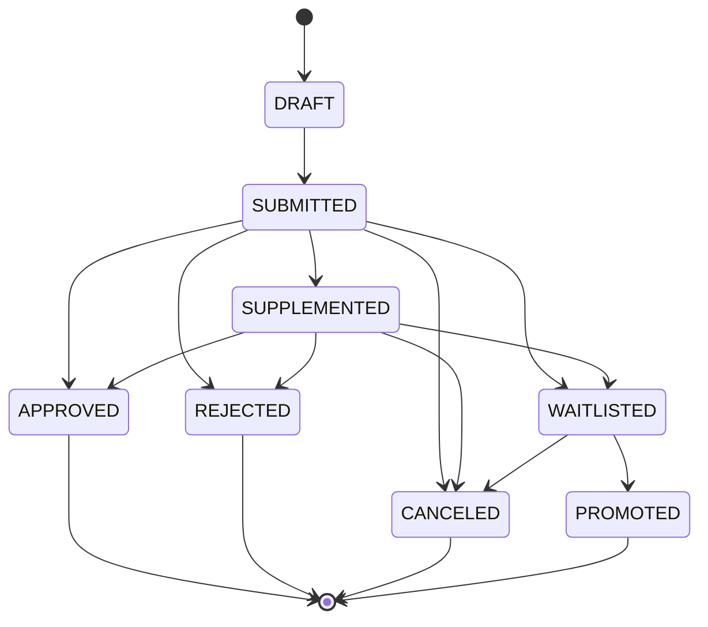

# Activity Registration and Funding Audit Management Platform - Implemented Architecture

This document describes the architecture that is currently implemented in this repository.

## 1) Scope and Deployment

- Offline-first deployment with local PostgreSQL and local disk storage.
- Runtime stack: FastAPI backend + Vue frontend, containerized via Docker Compose.
- API base path: `/api/v1`.

## 2) Implemented Module Map

- Backend modules:
  - `auth`: login/refresh/logout
  - `registrations`: create/list/get/submit/supplement
  - `uploads`: upload-init/chunk/finalize/material listing/history
  - `reviews`: queue/single transition/batch transition/logs
  - `finance`: accounts/transactions/overrun confirm/statistics
  - `quality`: compute/list/latest
  - `system`: audit logs/profile masking/backup/restore/exports
- Frontend role workspaces:
  - Applicant, Reviewer, Financial Admin, System Admin

## 3) Data Model (As Implemented)

### Core entities

- `roles`, `users`
- `activities`
- `registration_forms`
- `material_checklists`, `material_items`, `material_versions`
- `file_blobs`, `upload_sessions`
- `review_workflow_records`
- `funding_accounts`, `funding_transactions`
- `quality_validation_results`
- `audit_logs`
- `backup_records`

`data_collection_batches` is implemented as a runtime model and startup bootstrap table.

### Key table constraints (from ORM definitions)

- `users.username` unique
- `registration_forms` unique `(activity_id, applicant_user_id)`
- `material_checklists` unique `(activity_id, key)`
- `material_items` unique `(registration_form_id, checklist_id)` and checks:
  - `version_count >= 0 AND version_count <= 3`
  - `latest_label IN ('PENDING_SUBMISSION','SUBMITTED','NEEDS_CORRECTION')`
- `material_versions` unique `(material_item_id, version_no)` and checks:
  - `version_no BETWEEN 1 AND 3`
  - `status_label IN ('PENDING_SUBMISSION','SUBMITTED','NEEDS_CORRECTION')`
- `file_blobs.sha256` unique, `file_blobs.storage_path` unique
- `review_workflow_records` unique `(registration_form_id, idempotency_key)`
- `funding_transactions` unique `(activity_id, idempotency_key)` and checks:
  - `tx_type IN ('INCOME','EXPENSE')`
  - `tx_status IN ('CONFIRMED','PENDING_CONFIRMATION')`
  - `amount > 0`
- `quality_validation_results` checks:
  - `approval_rate BETWEEN 0 AND 1`
  - `correction_rate BETWEEN 0 AND 1`
  - `overspending_rate >= 0`

All business tables use `deleted_at` for soft-delete filtering in service queries.

## 4) State Machine (As Implemented)

### Transition map

- `DRAFT -> SUBMITTED`
- `SUBMITTED -> SUPPLEMENTED|APPROVED|REJECTED|CANCELED|WAITLISTED`
- `SUPPLEMENTED -> APPROVED|REJECTED|CANCELED|WAITLISTED`
- `WAITLISTED -> PROMOTED|CANCELED`
- `APPROVED|REJECTED|CANCELED|PROMOTED` are terminal



### Invalid transitions

- Any transition not in the map returns `409 INVALID_STATE_TRANSITION`.

## 5) File Storage and Naming (As Implemented)

- Temp upload path:
  - `/data/storage/.tmp/{upload_session_id}/upload.bin`
- Final material path:
  - `/data/storage/activities/{activity_id}/registrations/{registration_id}/materials/{material_item_id}/v{next_version}_{sha256}.{ext}`
- Blob metadata is stored in `file_blobs`; dedupe key is SHA-256.
- If SHA-256 already exists, blob row is reused and temp file is removed.

## 6) Authentication and Authorization

- Auth mode: username/password only.
- Password security: salted `scrypt` hashing.
- Tokens: JWT access + refresh.
- Lock policy:
  - failed window: 5 minutes
  - max attempts: 10
  - lock duration: 30 minutes
- Route-level role gates:
  - Reviewer routes: `REVIEWER` or `SYSTEM_ADMIN`
  - Finance routes: `FINANCIAL_ADMIN` or `SYSTEM_ADMIN`
  - System routes mostly `SYSTEM_ADMIN`, except `GET /users/{user_id}/profile` (authenticated user can query; non-admin values are masked)

## 7) Audit and Traceability

- Structured audit entries in `audit_logs`.
- Auth events, review transitions, finance writes, backup runs, and exports record audit rows.

## 8) Validation Strategy

- Frontend: basic input/form checks.
- Backend: authoritative validation via Pydantic schemas + service-level business checks.
- Standardized error envelope from global exception handlers.

## 9) Performance Characteristics

- Batch review hard cap `<= 50`.
- Upload chunk cap defaults to 5MB.
- Several list endpoints currently read full filtered rows then apply in-memory pagination.

## 10) Backup and Recovery

- Manual backup API: creates JSON DB snapshot (selected tables) + tar.gz storage archive + metadata JSON + `backup_records` row.
- Startup schedules a daily backup loop (default hour 02:00 UTC).
- Restore API supports in-place storage restore with required confirmation and optional pre-restore backup.

## 11) Failure Handling (Implemented)

- Upload failures:
  - session expiry -> conflict
  - out-of-order chunks -> conflict
  - incomplete finalize -> conflict
  - DB conflict on finalize -> rollback + explicit conflict
- Duplicate file conflicts:
  - same checklist latest hash match -> `DUPLICATE_MATERIAL_VERSION`
  - cross-registration/global hash reuse allowed
- State machine invalid transitions:
  - explicit `INVALID_STATE_TRANSITION`
- Batch operations:
  - `atomic=false`: partial success response with per-item result
  - `atomic=true`: operation fails if any item fails
- DB constraint violations:
  - mapped to explicit conflict/validation errors in services

## 12) Concurrency Control

- Hybrid strategy:
  - pessimistic locks via `SELECT ... FOR UPDATE` on critical update paths (upload finalize, review transition, supplement/submit, overrun confirm)
  - optimistic conflict check for review transitions through `If-Match` row version

## 13) Idempotency and Retry

- Upload finalize:
  - requires `Idempotency-Key`
  - repeated finalize with same key returns previously created latest-version payload
  - different key after finalize returns conflict
- Review transitions:
  - optional idempotency key stored per registration transition record
  - batch derives per-item keys from batch key
- Finance transactions:
  - `Idempotency-Key` required
  - unique `(activity_id, idempotency_key)` prevents double counting

## 14) System Invariants (Current Enforcement)

- File per-item version limit `<= 3`: DB checks + service checks.
- Single upload size `<= 20MB`: schema/service checks.
- Total upload size per registration `<= 200MB`: DB check constraint (`ck_reg_total_material_size`) + service check.

## 19) Reserved and Policy-Disabled Interfaces

- Reserved similarity interface is present and disabled by policy:
  - `GET /api/v1/reserved/similarity-check`
  - Returns `501 NOT_IMPLEMENTED` with message: `Feature disabled by policy`.

## 20) Strict Supplement Rule

- Supplement is allowed only when all conditions are true:
  1. registration has `submitted_at`
  2. `now <= submitted_at + 72h`
  3. `now <= activity.supplement_deadline`
- If any condition fails, API returns `409 SUPPLEMENT_WINDOW_CLOSED` with explicit reason.

## 21) Daily Backup Scheduler

- Startup launches a daily scheduler loop.
- On successful scheduled backup, normal backup records are created.
- On scheduler failure, an explicit failed audit entry is written (`error_code=SCHEDULER_ERROR`) instead of silent swallow.
- Review state legality: service transition map.
- Finance account/activity consistency: service check.
- Overrun >110% expense rule:
  - transaction is created as `PENDING_CONFIRMATION`
  - explicit confirm endpoint needed to mark `CONFIRMED`

## 15) Cross-Module Integration

- Uploads are linked through `registration_form_id` and `checklist_id` and recorded in material versions.
- Review transitions mutate registration status and create workflow records.
- Finance transactions attach optional invoice `file_blob_id` (resolved from finalized upload session).
- Quality metrics aggregate from registration status and confirmed expenses.

## 16) API Response and Error Envelope

Success envelope:

```json
{
  "success": true,
  "data": {},
  "meta": {
    "request_id": "req_xxx"
  }
}
```

Error envelope:

```json
{
  "success": false,
  "error": {
    "code": "VALIDATION_ERROR",
    "message": "Input validation failed",
    "details": {},
    "request_id": "req_xxx"
  }
}
```

## 17) Folder Structure (Current)

```text
full-stack/
  backend/
    app/
      api/
      core/
      models/
      repositories/
      schemas/
      security/
      services/
  frontend/
    src/
      router/
      services/
      stores/
      views/
  shared/
    database/
```

## 18) Testing Strategy (Current)

- Unit tests in `unit_tests/` currently focus on transition-map and masking helper behavior.
- API smoke tests in `API_tests/test_api.sh` cover login and selected endpoints.
- Full orchestrated test command is `./run_tests.sh` (Docker-based).
